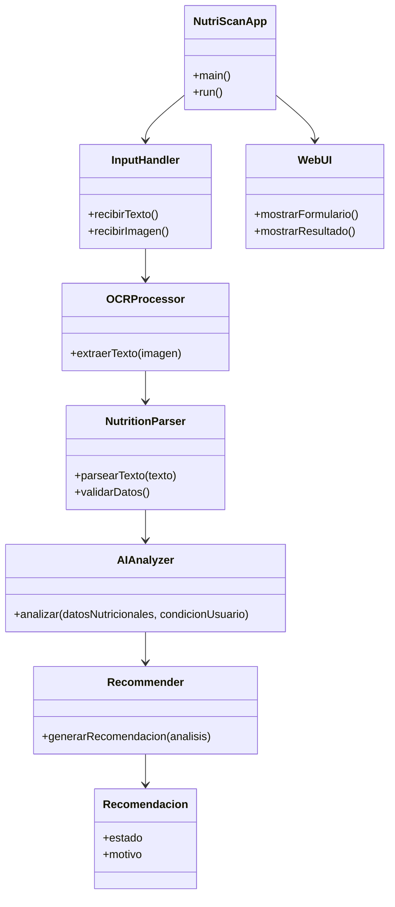

# **Scrum aplicado a NutriScan AI**

* **Proyecto**: NutriScan AI
* **Tecnología**: Python (Reflex), API IA (Gemini/ChatGPT)
* **Metodología**: Scrum
* **Nota**: **PO + SM + Dev** único, Scrum ligero para desarrollo individual.

---

## **Pre-Sprint 0: Preparación y Product Backlog Inicial (Día 1 - 3)**

**Actividad principal:**

* Definir alcance del MVP.
* Crear repositorio GitHub y configurar Reflex, GitHub Actions (pruebas básicas), Issues y Projects.
* Esbozar arquitectura:

  * Módulo de captura de datos nutricionales (texto o imagen).
  * Módulo de análisis IA (con API externa).
  * Módulo de recomendación según tabla nutricional estándar.
  * Interfaz web simple para entrada/salida.

---

### **Análisis del Dominio**

**Product Backlog inicial (priorizado)**:

1. **HU1**: Como usuario, quiero subir una imagen o texto con la información nutricional de un producto.
2. **HU2**: Como usuario, quiero que la app extraiga y estructure la información nutricional (gramos, calorías, azúcar, etc.).
3. **HU3**: Como usuario, quiero que el sistema analice los datos usando una IA externa y una tabla nutricional estándar.
4. **HU4**: Como usuario, quiero recibir una recomendación clara de consumo (apto/no apto) según mi condición (ej. diabetes).
5. **HU5**: Como usuario, quiero que el sistema me explique de forma simple el motivo de la recomendación.
6. **HU6**: Como desarrollador, quiero pruebas unitarias para los módulos de análisis y recomendación.
7. **HU7**: Como usuario, quiero que la interfaz sea simple y usable desde el móvil.
8. **HU8**: Como usuario, quiero que los datos que subo no se almacenen permanentemente (privacidad).

---

## **Diseño Estático Inicial**

* **Lenguaje**: Python (Reflex para frontend + backend).
* **Arquitectura**: Separación en capas (Captura → Procesamiento → Análisis → Recomendación → Presentación).
* **Diagrama de Clases (PMV)**:

---

## **Sprint 1 (2 semanas)**

**Objetivo**:
MVP que permite subir texto, analizarlo con la IA y devolver una recomendación básica (sin OCR ni móvil optimizado).

**Historias seleccionadas**: HU1, HU2, HU3, HU4.

**Entregable**:
Versión v0.1 funcional, entrada solo por texto, recomendación simple.

---

## **Sprint 2 (2 semanas)**

**Objetivo**:
Agregar OCR, explicación clara del análisis y pruebas unitarias básicas.

**Historias seleccionadas**: HU5, HU6.

**Entregable**:
Versión v0.2 con OCR y justificación de la recomendación.

---

## **Sprint 3 (2 semanas)**

**Objetivo**:
Optimizar UI para móviles y asegurar privacidad de datos.

**Historias seleccionadas**: HU7, HU8.

**Entregable**:
Versión v1.0 lista para pruebas con usuarios.

---

## **Herramientas de seguimiento**

* **GitHub Projects**: Kanban (To do / In progress / Done).
* **GitHub Issues**: Cada HU como issue, con etiquetas.
* **GitHub Releases**: Publicar versión de cada sprint.

